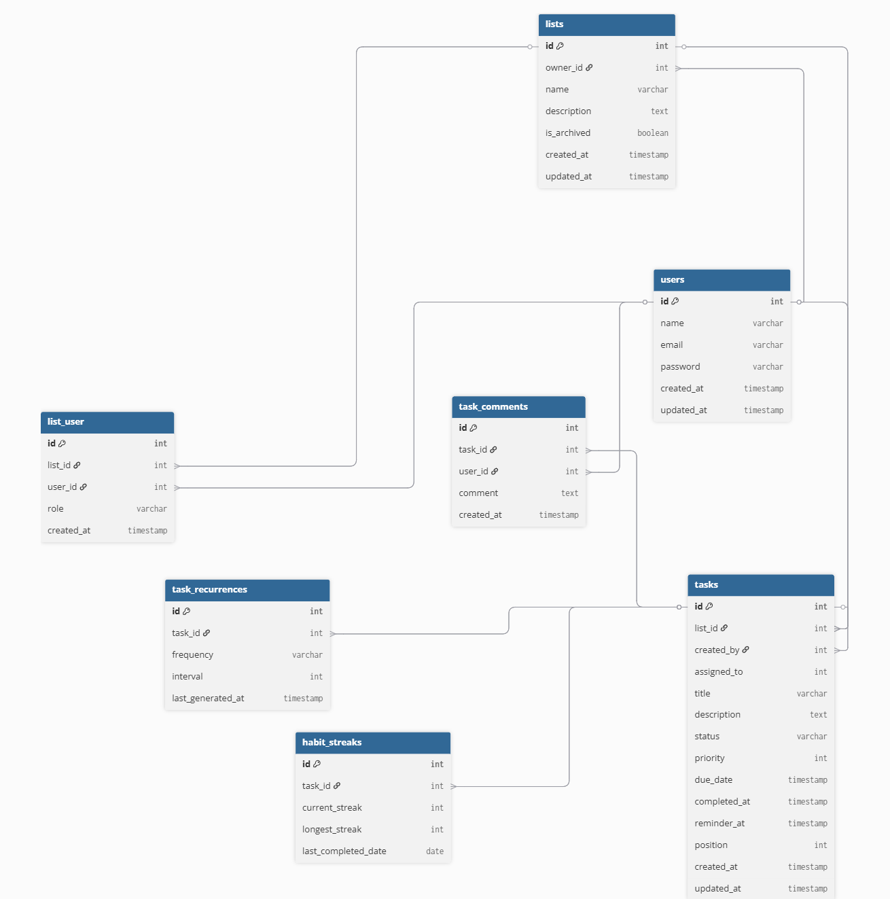

# Shared To-Do Backend – Beginner-Friendly Docs

**Stack:** Laravel (API-only) · PostgreSQL · Redis  
**Base URL:** `http://localhost:8000/api`  
**API Docs:** `http://localhost:8000/docs/api`  

> This is a simple guide to understand the backend quickly.

---

## Database Diagram

> Visual representation of tables and their relationships.

---

## 1. Users & Authentication

**What it does:**  
Handles signing up, logging in, logging out, and getting info about the logged-in user.

### Database Table: `users`

| Column     | What it stores                  |
|----------- |-------------------------------- |
| id         | Unique ID for the user          |
| name       | User’s name                     |
| email      | User’s email (must be unique)   |
| password   | Encrypted password              |
| created_at | When the user was created       |
| updated_at | When info was last updated      |

### API Endpoints

| Method | Endpoint       | What it does                              |
|--------|--------------- |------------------------------------------ |
| POST   | /auth/register | Sign up a new user                        |
| POST   | /auth/login    | Login and get a token                     |
| POST   | /auth/logout   | Log out the user                          |
| GET    | /auth/profile  | Get info about the logged-in user         |

---

## 2. To-Do Lists

**What it does:**  
Create, view, update, and archive your lists.

### Database Table: `lists`

| Column      | What it stores                       |
|------------ |------------------------------------- |
| id          | Unique ID for the list               |
| name        | Name of the list                     |
| description | Optional description of the list     |
| is_archived | Whether the list is archived or not  |
| created_at  | When the list was created            |
| updated_at  | Last time the list was updated       |

### Database Table: `list_user`

**Handles which users can access a list and their role**

| Column    | What it stores                         |
|---------- |--------------------------------------  |
| list_id   | ID of the list                         |
| user_id   | ID of the user                         |
| role      | Role in the list: owner, editor, viewer|
| created_at| When the user was added                |
| updated_at| Last time role changed                 |

### API Endpoints

| Method | Endpoint           | What it does                           |
|--------|------------------  |--------------------------------------- |
| POST   | /lists             | Create a new list                      |
| GET    | /lists             | See all your lists                     |
| PATCH  | /lists/{list_id}   | Update list name or description        |
| DELETE | /lists/{list_id}   | Archive or delete a list               |

---

## 3. Sharing Lists & Permissions

**What it does:**  
Let other users access your lists and control what they can do.

### API Endpoints

| Method | Endpoint                          | What it does                                         |
|--------|-----------------------------------|---------------------------------------               |
| POST   | /lists/{list_id}/share            | Share a list with another user                       |
| PATCH  | /lists/{list_id}/users/{user_id}  | Change that user’s role (owner/collaborator viewer)  |
| DELETE | /lists/{list_id}/users/{user_id}  | Remove that user from the list                       |

---

## Quick Summary for Beginners

1. **Users table** → manages user accounts  
2. **Lists table** → stores your to-do lists  
3. **list_user table** → controls which users see which lists and their permissions  
4. **Endpoints** → how the frontend talks to the backend  

> ✅ All features are implemented, tested, and ready.  
> 📌 Check the API in your browser: [http://localhost:8000/docs/api](http://localhost:8000/docs/api)
